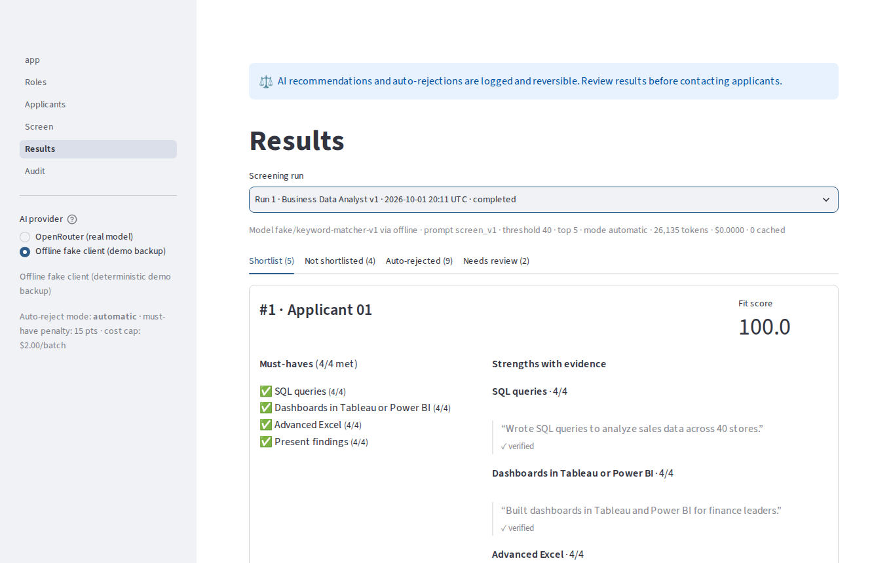

# TalentSift

**Employer-side AI resume screening with a ranked, explained, fully auditable shortlist.** A hiring manager pastes a
job posting, approves an AI-drafted rubric, and screens a folder of resumes. Low scorers are auto-rejected with
job-related reasons; every automated decision is logged and reversible.

Built as the MVP for a Systems Analysis & Design course project. Fictional data only.



## Quick start (local, offline, about 2 minutes)

```bash
python -m venv .venv && source .venv/bin/activate      # Windows: .venv\Scripts\activate
pip install -r requirements.txt
cp .env.example .env                                    # leave the key empty to run offline
pytest                                                  # ~190 tests, all offline
python scripts/seed_demo.py --screen                    # 2 roles, 20 fictional resumes, 2 screening runs
streamlit run app.py
```

No API key? The app uses the deterministic **offline fake client**. It is also the demo backup: switch to it in
the sidebar if the network fails mid-presentation.

## What it does

| Page | What the manager does |
|------|-----------------------|
| **Roles** | Paste a posting or load it from a job-board link. The AI drafts 5-10 criteria (type, weight) and flags possible proxies for protected characteristics. Edit, approve, duplicate, version. Set the auto-reject threshold (default 40) and shortlist size (default 5). |
| **Applicants** | Browse to a folder of resumes. A preview lists exactly which files will be sent (PDFs only; everything else is listed with the reason it is skipped). Or upload PDFs. Toggle the masked preview: exactly what the AI sees. |
| **Screen** | Pick an approved role and batches, run, and watch progress, tokens, and cost. |
| **Results** | Tabs for Shortlist, Not shortlisted, Auto-rejected, Needs review. Evidence quotes, must-have checklist, reasons, overrides, one-click reinstatement (reason required), confirm-mode approval. |
| **Audit** | Filter the append-only log, read raw prompts and replies, export CSV, run the consistency and name-swap fairness checks. |
| **Settings** | Paste your OpenRouter API key and model. Stored in the local `.env`, shown masked, never logged. |

## How decisions are made

1. **Mask first.** Names, emails, phones, addresses and ZIP codes, URLs and handles, and image content are removed
   in code. The model only sees masked text and a label such as "Applicant 07".
2. **The model scores; code decides.** One call per applicant at temperature 0 returns a 0-4 score, rationale, and
   verbatim quotes for each criterion. Every quote is checked against the masked resume.
3. **Fit score (0-100)** = weighted average of criterion scores (high 3, medium 2, low 1), minus
   `MUST_HAVE_PENALTY` (15) points per must-have scored 0-1, never below 0.
4. **Ranking**: fit score, then must-haves met, then applicant id. Never by name.
5. **Status**: top N at or above the threshold are shortlisted (exact ties at the cutoff included); below the
   threshold is auto-rejected; everyone else is not shortlisted.
6. **Guardrails**: failed validation, unverified evidence, partially parsed or truncated resumes, and unscored
   applicants go to **Needs review**, never auto-reject.
7. **`AUTO_REJECT_MODE`**: `automatic` (team decision) or `confirm` (the manager approves each batch first).

Rationale for each rule: [docs/decisions.md](docs/decisions.md).

## Import a job posting from a link

On **Roles**, paste a job-posting URL and click **Load**. TalentSift fetches the page and pulls out the posting:

1. **Structured data first.** Most job boards and applicant tracking systems (Greenhouse, Lever, Workable, LinkedIn,
   Indeed, many career sites) embed a schema.org `JobPosting`; when present it is used as-is.
2. **Then the page itself**, with BeautifulSoup: a container named like a job description, the page's
   `<main>`/`<article>`, or the densest block of paragraph and list text, after navigation, footers, cookie
   banners, and "similar jobs" panels are stripped.

Review the loaded text before drafting the rubric. Pages that render only with JavaScript or sit behind a login
cannot be read; the app says so, and you paste the posting instead. Only public `http(s)` addresses are fetched
(private and local network addresses are refused, including after redirects). Each import is logged as
`posting_imported`.

## Use a real model through OpenRouter

1. Create a key at [openrouter.ai](https://openrouter.ai) and set a spending limit on it.
2. Open **Settings** in the app, paste the key and a model slug, and click **Save and use OpenRouter**. The key is
   written to the local `.env` (gitignored) and applied immediately. Or edit `.env` by hand:
   `LLM_PROVIDER=openrouter`, `OPENROUTER_API_KEY=...`, `LLM_MODEL=<any OpenRouter slug>`.
3. Run `python scripts/seed_demo.py --reset --screen --provider openrouter`, or pick "OpenRouter" in the app sidebar.

**Swap models** by changing `LLM_MODEL` only. Prefer models listed with structured-output support
([filter](https://openrouter.ai/models?supported_parameters=structured_outputs)). Requests send a strict JSON schema
with `provider.require_parameters=true`; if a model rejects that, the client falls back to plain JSON instructions
plus validation and logs `llm_fallback`. Each run records the model and provider actually used, tokens, and cost.

**Swap providers entirely** by implementing `LLMClient.complete_json(system, user, schema) -> LLMResult`
(see `talentsift/llm/base.py`) and returning it from `talentsift/llm/factory.py`.

**Cost control**: `COST_CAP_USD` (default $2.00 per batch) stops a run cleanly; unscored applicants land in Needs
review. Re-runs reuse cached results at no cost; "Force re-score" bypasses the cache.

## Configuration

| Variable | Default | Purpose |
|----------|---------|---------|
| `LLM_PROVIDER` | `openrouter` if a key is set, else `fake` | `openrouter` or `fake` |
| `OPENROUTER_API_KEY` | (empty) | OpenRouter key; never committed or logged |
| `LLM_MODEL` | (empty) | OpenRouter model slug |
| `LLM_TIMEOUT_SECONDS` / `LLM_MAX_TOKENS` | 60 / 4000 | Per-call limits |
| `LLM_CONCURRENCY` | 4 | Parallel AI calls during a run |
| `COST_CAP_USD` | 2.00 | Per-batch spending cap |
| `AUTO_REJECT_MODE` | `automatic` | `automatic` or `confirm` |
| `MUST_HAVE_PENALTY` | 15 | Points per unmet must-have |
| `MASK_GRAD_YEARS` | `false` | Also mask years in the education section |
| `MAX_RESUME_CHARS` | 24000 | Longer resumes are truncated and sent to review |
| `DATABASE_URL` | `sqlite:///data/talentsift.db` | SQLite file (relative paths resolve to the project root) |
| `AUTO_SEED_DEMO` | `false` | Load and screen the demo data when the database is empty |

Temperature is fixed at 0 in code on purpose.

## Optional: hosted demo on Streamlit Community Cloud

1. Push the repo to GitHub and create an app at [share.streamlit.io](https://share.streamlit.io) with
   `app.py` as the entry point and Python 3.11+.
2. In **Settings > Secrets**, add:
   ```toml
   LLM_PROVIDER = "openrouter"   # or "fake" for a free, offline demo
   OPENROUTER_API_KEY = "sk-or-..."
   LLM_MODEL = "your/model-slug"
   AUTO_SEED_DEMO = "true"
   ```
   Root-level secrets are copied into the environment at startup (`ui.load_streamlit_secrets`).
3. The hosted disk resets on reboot. `AUTO_SEED_DEMO` reloads the fictional demo automatically; you can also click
   **Load demo data** on the home page.

Do not deploy to Vercel: Streamlit needs a long-lived server session, and Vercel functions do not keep a SQLite
file between requests ([D-005](docs/decisions.md)). Never upload real applicant data to a hosted demo.

## Add a file parser

Scoring only sees text, so a new format is one class plus one line:

```python
# talentsift/parsers/txt.py
from pathlib import Path
from talentsift.models import PARSE_PARSED
from talentsift.parsers.base import ParsedResume

class TxtParser:
    name = "txt"
    extensions = (".txt",)

    def supports(self, path: Path) -> bool:
        return Path(path).suffix.lower() in self.extensions

    def parse(self, path: Path) -> ParsedResume:
        return ParsedResume(text=Path(path).read_text(), status=PARSE_PARSED, page_count=1)
```

Then add `TxtParser()` to `_PARSERS` in `talentsift/parsers/registry.py` and a test in `tests/test_parsers.py`.
`DocxParser` is registered as a stub so DOCX uploads get a clear "planned for final project" message.

## Project layout

```
app.py                 Home page (entry point)
pages/                 Roles, Applicants, Screen, Results, Audit
talentsift/            config, db, models, schemas, parsers/, masking, ingest, llm/, prompts,
                       rubric, roles, scoring, overrides, fairness, audit, demo, ui
prompts/               screen_v1.md, rubric_draft_v1.md (versioned; never edit in place)
scripts/               make_sample_resumes.py, seed_demo.py
data/resumes/samples/  20 fictional resumes (everything else in data/ is gitignored)
docs/                  plan (WBS), requirements, traceability, decisions, architecture
tests/                 pytest suite, run in CI on every pull request
```

Ownership for parallel work (data, AI, UX owners) is in [CONTRIBUTING.md](CONTRIBUTING.md).

## Process artifacts (SDLC)

- [docs/plan.md](docs/plan.md): plan, WBS, file tree, build sequence, risks
- [docs/requirements.md](docs/requirements.md): FR-1..FR-28, NFR-1..NFR-12
- [docs/traceability.md](docs/traceability.md): requirement -> module -> test, plus the definition of done
- [docs/decisions.md](docs/decisions.md): dated decision log
- [docs/architecture.md](docs/architecture.md): context diagram, Level-0 DFD, screening sequence (Mermaid)
- [CHANGELOG.md](CHANGELOG.md), issue and PR templates in `.github/`, CI in `.github/workflows/tests.yml`
- Branches: one per WBS task (`wbs-4.3-scoring-engine`); commits follow Conventional Commits

## Known limitations

- **Formats**: text-based PDFs only. DOCX is a stub; scanned PDFs are flagged `needs_ocr` and skipped.
- **Name masking is a heuristic.** It takes the name from the first line and masks every later capitalized
  occurrence. If line one is not the name, the name is missed; capitalized words that match a name (for example
  "Grant") are over-masked. Other signals can remain (affinity groups, locations without ZIP codes, pronouns).
- **Address and phone masking** target US-style addresses with ZIP codes, North American numbers, and "+"
  international numbers.
- **Evidence checks prove a quote exists, not that it supports the score.** Reviewers should still read them.
- **The offline client is a keyword matcher** for tests and demos, not a real assessment.
- **Cost cap** relies on the cost OpenRouter reports, and can overshoot by the calls already in flight.
- **Ties enlarge the shortlist.** Applicants tied with the N-th score are all shortlisted rather than split by upload
  order, so "top 5" can show 6 or more when scores tie ([D-009](docs/decisions.md)).
- **Overrides belong to a run.** A new screening run makes fresh automated decisions.
- **Single user, no authentication, local SQLite.** Planned for the final project along with OCR, DOCX, emailing
  candidates, ATS integrations, side-by-side compare, and fairness dashboards.
- **Live OpenRouter run**: the client is verified against mocked HTTP in the test suite; run the OpenRouter
  command above with your key to complete the live check.
