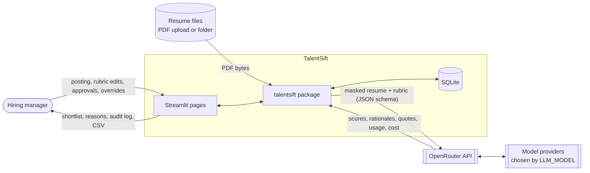
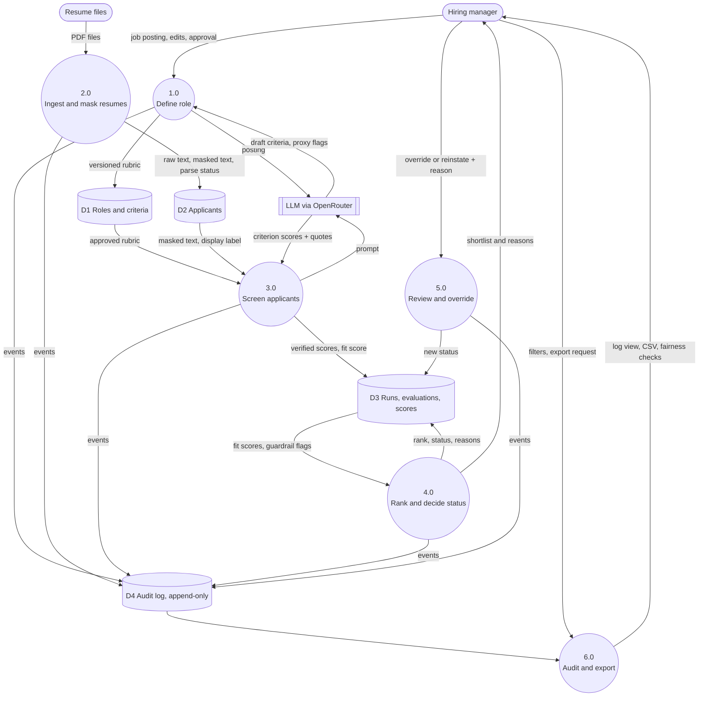
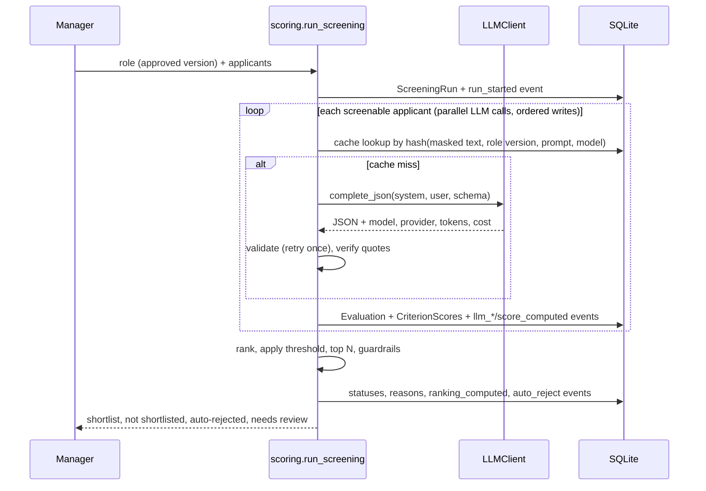

# Architecture

## Context diagram

TalentSift is a single Streamlit application with a local SQLite database. The only external system is the LLM
provider, reached through OpenRouter. Resumes are read from uploads or a local folder.

Only masked text and a display label such as "Applicant 07" ever leave the machine.

## Level-0 data flow diagram

## Module map

| Layer | Modules | Notes |
|-------|---------|-------|
| UI | `app.py`, `pages/*.py`, `talentsift/ui.py` | Thin: pages call package functions and render results |
| Domain services | `roles.py`, `rubric.py`, `ingest.py`, `scoring.py`, `overrides.py`, `fairness.py`, `demo.py` | All business rules live here and are unit tested |
| AI | `llm/base.py`, `llm/openrouter_client.py`, `llm/fake_client.py`, `llm/factory.py`, `schemas.py`, `prompts.py` | Provider-agnostic `LLMClient`; no database access from the LLM layer |
| Data | `models.py`, `db.py`, `audit.py`, `parsers/*`, `masking.py` | SQLite via SQLModel; append-only audit and override tables |

## Screening sequence

## Key design rules

1. **The LLM scores criteria; code decides.** Fit score, ranking, and status are computed in code from 0-4 criterion scores.
2. **Evidence or it did not happen.** Every quote is checked against the masked text before it can support a decision.
3. **Uncertainty goes to a human.** Validation failures, unverified evidence, partial parses, truncated input, and unscored applicants go to `needs_review`, never to auto-reject.
4. **Append-only history.** Audit events and overrides cannot be updated or deleted (SQLite triggers plus an ORM guard).
5. **Swap, don't rewrite.** New models change one env var; new file formats add one parser class.
